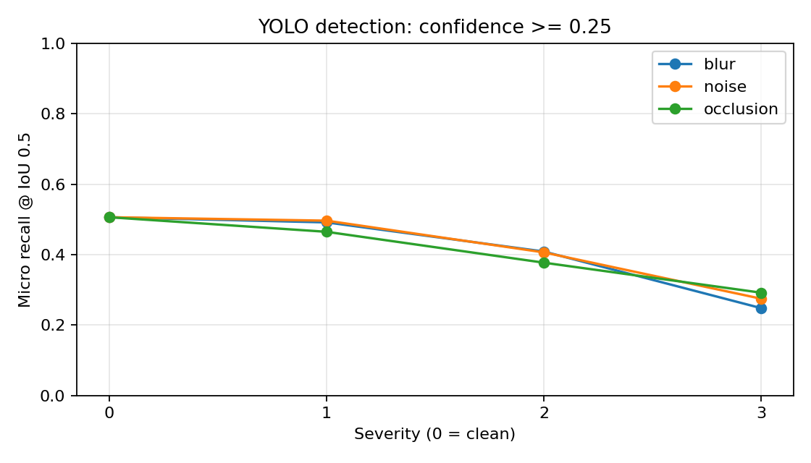
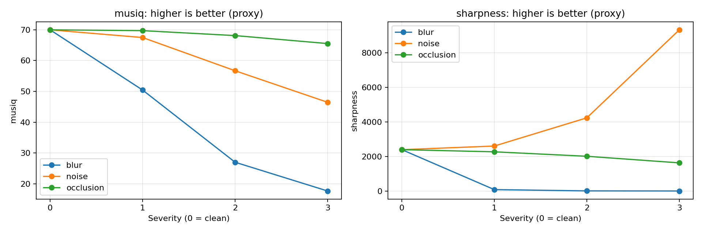
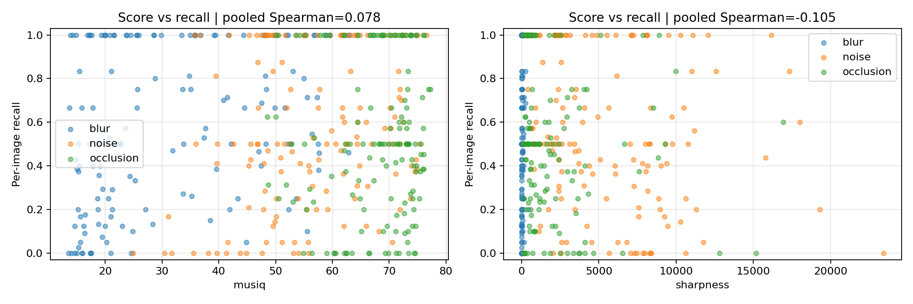
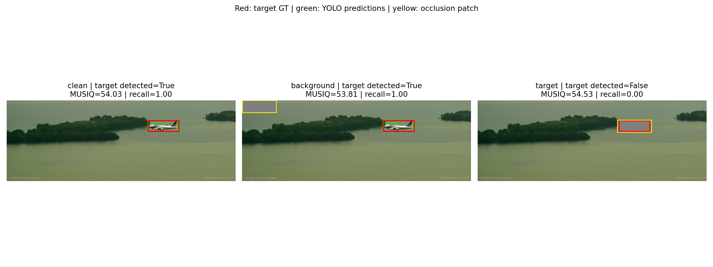

# Báo cáo kết quả — Nguyễn Văn Giáp

- Vai trò: **code_runner, chốt metrics**.
- Mục tiêu: Đối chiếu cấu hình, kết quả từng ảnh và bảng tổng hợp để chốt metrics.
- Nguồn: kết quả benchmark chung đã có trong dự án; báo cáo được phân tích theo phân công tại [TEAMMATES.md](../TEAMMATES.md).
- Không có lượt inference mới khi soạn báo cáo; dữ liệu hiện có không xác nhận lịch sử ai trực tiếp chạy từng phép thử.

## 1. Thiết kế và phạm vi

50 ảnh COCO128 có nhãn, mỗi ảnh đánh giá trên ảnh sạch và 9 biến thể lỗi: tổng 500 dòng kết quả. Seed 42; YOLO `yolo11n.pt`; confidence 0,25; IoU ghép nhãn 0,5; NMS IoU 0,7; kích thước YOLO 640; cạnh ảnh tối đa trước tạo lỗi 960 pixel. Chỉ chạy suy luận, không huấn luyện. MUSIQ bật, dùng cùng ảnh với detector.

**Bảng 1. Tham số lỗi** — nguồn [config.json](../config.json) và hàm `corrupt` trong [notebook](../camera-health-kaggle.ipynb).

| Lỗi | Mức 1 | Mức 2 | Mức 3 | Đơn vị / cơ chế |
| --- | --- | --- | --- | --- |
| Mờ Gaussian | 1 | 2 | 4 | σ theo pixel |
| Nhiễu Gaussian | 5 | 15 | 30 | σ theo mức cường độ 0–255 |
| Che khuất | 5% | 15% | 30% | Diện tích dự kiến; mảng xám 127 |

## 2. Lệnh chạy mẫu và cách tái lập

Các lệnh dưới đây là hướng dẫn chạy lại, chưa được thực thi trong lần soạn báo cáo này. Chạy tại thư mục gốc dự án trong môi trường đã có Python, torch/torchvision tương thích và quyền tải dữ liệu/weights.

```bash
python -m pip install ultralytics pyiqa scipy pandas matplotlib tqdm jupyter nbconvert ipykernel
python -m jupyter nbconvert --to notebook --execute camera-health-kaggle.ipynb --ExecutePreprocessor.timeout=-1 --output camera-health-executed.ipynb --output-dir /tmp
```

Notebook hiện đặt `MODE = 'benchmark'`, `USE_MUSIQ = True`, `SEED = 42`. Để kiểm tra môi trường nhanh, đổi `MODE = 'smoke'` rồi chạy toàn bộ; sau đó đổi về `benchmark` để lấy kết quả 50 ảnh. Đây là biến cấu hình trong notebook, không phải cờ dòng lệnh. Có thể chạy trên Kaggle bằng Import notebook → bật GPU và Internet → Run All.

Nếu dữ liệu hoặc weights được chuẩn bị sẵn, đặt `DATASET_ROOT`, `YOLO_WEIGHTS`, `MUSIQ_WEIGHTS` tại ô cấu hình. Kết quả chạy mới nằm trong `camera_work/camera_health_benchmark_<RUN_ID>/` khi chạy local, hoặc `/kaggle/working/camera_health_benchmark_<RUN_ID>/` trên Kaggle. Đối chiếu CSV/PNG ở thư mục chạy mới với các tệp được dẫn trong báo cáo. Notebook tự sinh `report.md` bằng tiếng Anh trong thư mục chạy mới; báo cáo tiếng Việt này là bản tổng hợp riêng.

Môi trường đã ghi nhận: torch 2.11.0+cu128, torchvision 0.26.0+cu128, ultralytics 8.4.173, pyiqa 0.1.16, numpy 2.1.3, scipy 1.16.3, pandas 2.3.3; thiết bị `cuda:0`. Xem [versions.json](../versions.json) và [pip-freeze.txt](../pip-freeze.txt). Lệnh cài mẫu không khóa phiên bản; cần dùng thông tin môi trường đã ghi để đối chiếu nếu kết quả khác.

## 3. Kết quả định lượng đầy đủ

**Bảng 2. Baseline và toàn bộ mức lỗi** — nguồn [summary.csv](../summary.csv), đối chiếu [per_image_results.csv](../per_image_results.csv). Mỗi hàng có 50 ảnh, 411 vật thể có nhãn. Số liệu làm tròn khi hiển thị; mức giảm tính từ số gốc.

| Điều kiện | Mức | TP | FP | Recall micro | Precision micro | Recall macro | Retention micro | MUSIQ TB | Laplacian TB | Giảm recall (đpt) |
| --- | --- | --- | --- | --- | --- | --- | --- | --- | --- | --- |
| Ảnh sạch | 0 | 208 | 83 | 0.5061 | 0.7148 | 0.7010 | 1.0000 | 69.958 | 2395.019 | 0.00 |
| Mờ | 1 | 202 | 73 | 0.4915 | 0.7345 | 0.6885 | 0.9231 | 50.420 | 82.980 | 1.46 |
| Mờ | 2 | 168 | 66 | 0.4088 | 0.7179 | 0.6323 | 0.7788 | 27.010 | 8.994 | 9.73 |
| Mờ | 3 | 102 | 41 | 0.2482 | 0.7133 | 0.4172 | 0.4808 | 17.683 | 2.341 | 25.79 |
| Nhiễu | 1 | 204 | 78 | 0.4964 | 0.7234 | 0.6827 | 0.9567 | 67.456 | 2605.087 | 0.97 |
| Nhiễu | 2 | 167 | 56 | 0.4063 | 0.7489 | 0.5985 | 0.7837 | 56.685 | 4237.394 | 9.98 |
| Nhiễu | 3 | 113 | 52 | 0.2749 | 0.6848 | 0.3949 | 0.5385 | 46.454 | 9330.933 | 23.11 |
| Che khuất | 1 | 191 | 86 | 0.4647 | 0.6895 | 0.6497 | 0.8990 | 69.688 | 2270.395 | 4.14 |
| Che khuất | 2 | 155 | 128 | 0.3771 | 0.5477 | 0.5122 | 0.6971 | 68.085 | 2012.187 | 12.90 |
| Che khuất | 3 | 120 | 121 | 0.2920 | 0.4979 | 0.3988 | 0.5288 | 65.499 | 1630.729 | 21.41 |

Recall micro = ΣTP/ΣGT; precision micro = ΣTP/(ΣTP+ΣFP); recall macro = trung bình recall từng ảnh. Retention micro = số GT được phát hiện đúng ở cả ảnh sạch và ảnh lỗi / số GT phát hiện đúng trên ảnh sạch. Các tỷ lệ không có đơn vị; “đpt” là điểm phần trăm. MUSIQ là điểm đầu ra mô hình; Laplacian là phương sai trên ảnh xám, theo bình phương mức cường độ của toán tử trong notebook. Không chuyển các điểm này thành phần trăm sức khỏe phần cứng.

**Bảng 3. Tương quan Spearman thăm dò** — nguồn [correlations.csv](../correlations.csv); bỏ ảnh sạch, dùng kết quả từng ảnh.

| Nhóm | ρ MUSIQ–recall | ρ MUSIQ–retention | ρ Laplacian–recall | ρ Laplacian–retention | n |
| --- | --- | --- | --- | --- | --- |
| Tất cả lỗi | 0.078 | 0.131 | -0.105 | -0.081 | 450 |
| Mờ | 0.359 | 0.487 | 0.223 | 0.393 | 150 |
| Nhiễu | 0.243 | 0.430 | -0.299 | -0.308 | 150 |
| Che khuất | 0.038 | 0.209 | -0.231 | -0.106 | 150 |

**Bảng 4. Tính không tăng của score theo mức lỗi** — nguồn [monotonicity.csv](../monotonicity.csv). Mỗi loại lỗi gồm 50 ảnh × 3 bước chuyển từ mức 0 đến 3.

| Loại lỗi | Chỉ số | Tỷ lệ bước không tăng |
| --- | --- | --- |
| Mờ | musiq | 100.00% |
| Mờ | sharpness | 100.00% |
| Nhiễu | musiq | 98.67% |
| Nhiễu | sharpness | 0.00% |
| Che khuất | musiq | 80.00% |
| Che khuất | sharpness | 91.33% |

## 4. Plot và cách đọc

**Hình 1. Recall micro theo mức lỗi** — [recall_vs_severity.png](../recall_vs_severity.png); dữ liệu Bảng 2. Mức 0 là ảnh sạch, 1–3 là mức tham số trong Bảng 1. Recall giảm theo mức với cả ba loại lỗi; các mức 1–3 giữa các loại lỗi không có cùng đơn vị vật lý.



**Hình 2. MUSIQ và phương sai Laplacian theo mức lỗi** — [quality_vs_severity.png](../quality_vs_severity.png); dữ liệu trung bình từ Bảng 2. MUSIQ trung bình giảm, nhưng Laplacian tăng với nhiễu. Dòng “higher is better” trên plot chỉ là mô tả proxy, không đủ để diễn giải chất lượng phát hiện khi có nhiễu.



**Hình 3. Score và recall từng ảnh** — [quality_vs_recall.png](../quality_vs_recall.png); nguồn [per_image_results.csv](../per_image_results.csv), hệ số ở Bảng 3. Plot có 450 biến thể từ 50 ảnh nguồn; các điểm cùng nguồn không độc lập.



## 5. Phép thử theo cặp và failure case

**Bảng 5. Cặp máy bay `000000000472.jpg`, GT index 0** — nguồn [occlusion_pairs.csv](../occlusion_pairs.csv), cùng detector và ngưỡng như benchmark. Patch nền không giao các hộp GT; patch mục tiêu cùng kích thước/màu. Đây là phép thử riêng, không phải hàng che khuất mức 1–3 trong Bảng 2.

| Biến thể | Phát hiện máy bay | MUSIQ | Laplacian | Recall ảnh | Diện tích che |
| --- | --- | --- | --- | --- | --- |
| clean | True | 54.034 | 168.468 | 1.0000 | 0.000% |
| background | True | 53.810 | 168.454 | 1.0000 | 2.323% |
| target | False | 54.535 | 71.641 | 0.0000 | 2.323% |

**Hình 4. Ảnh sạch, che nền và che mục tiêu** — [failure_case.png](../failure_case.png). Đỏ: hộp GT mục tiêu; xanh: dự đoán YOLO; vàng: vùng che. Ảnh riêng: [clean](../failure_clean.png), [background](../failure_background.png), [target](../failure_target.png).



**Bảng 6. Toàn bộ cặp hợp lệ được lưu** — nguồn [occlusion_pairs.csv](../occlusion_pairs.csv).

| Ảnh | Mục tiêu | Che nền: phát hiện | Che mục tiêu: phát hiện | MUSIQ nền | MUSIQ mục tiêu | Chênh lệch tuyệt đối |
| --- | --- | --- | --- | --- | --- | --- |
| 000000000404.jpg | boat | True | False | 74.393 | 71.624 | 2.769 |
| 000000000030.jpg | vase | True | False | 72.333 | 66.636 | 5.697 |
| 000000000542.jpg | person | True | False | 56.488 | 57.378 | 0.890 |
| 000000000472.jpg | airplane | True | False | 53.810 | 54.535 | 0.725 |
| 000000000294.jpg | microwave | True | False | 71.116 | 70.271 | 0.845 |

## 6. Phân tích theo vai trò

Bảng 2 có 10 điều kiện, mỗi điều kiện 50 ảnh và 411 nhãn chuẩn. Baseline có TP = 208; mức lỗi nặng có TP lần lượt 102, 113, 120 cho mờ, nhiễu và che khuất. Retention micro tương ứng là 100/208 = 0,4808; 112/208 = 0,5385; 110/208 = 0,5288. Retention không bằng recall vì chỉ xét các mục tiêu đã được phát hiện trên ảnh sạch.

Recall micro giảm qua cả ba mức với từng loại lỗi (Hình 1). Precision không giảm đều trong mọi điều kiện: nhiễu mức 2 có precision micro 0,7489, cao hơn baseline 0,7148, trong khi recall giảm xuống 0,4063. Không thể kết luận toàn bộ chất lượng detector tốt hơn chỉ từ precision.

Đầu ra theo vai trò: số liệu thống nhất từ `per_image_results.csv` sang `summary.csv`, định nghĩa đơn vị và mức giảm. Không dùng trung bình recall theo ảnh thay cho recall gộp và không coi 450 biến thể là 450 ảnh nguồn độc lập.

## 7. Năm câu hỏi và bằng chứng

| Câu cần trả lời | Kết quả / diễn giải | Bằng chứng |
| --- | --- | --- |
| Sensor gặp lỗi gì, ở mức nào? | Mờ, nhiễu, che khuất tổng hợp; chưa chẩn đoán lỗi sensor vật lý | Bảng 1; config.json; notebook |
| Metric thay đổi ra sao? | Recall baseline 0,5061; mức nặng: mờ 0,2482, nhiễu 0,2749, che khuất 0,2920 | Bảng 2; Hình 1–2; summary.csv |
| Thuật toán/tính năng bị ảnh hưởng thế nào? | Đo trực tiếp: recall giảm và mất phát hiện máy bay; suy luận: điểm toàn ảnh có thể bỏ qua vùng quan trọng | Bảng 3, 5–6; Hình 3–4 |
| Phương pháp còn hạn chế ở đâu? | Tập nhỏ, có thể trùng dữ liệu huấn luyện; một detector; lỗi mô phỏng; mẫu lặp | Mục 8; cấu hình và thiết kế notebook |
| Nên làm gì tiếp? | Thử điểm theo vùng và fallback trên dữ liệu độc lập, đo cảnh báo sai và mức phục hồi | Mục 9; kế hoạch chưa thực thi |

## 8. Hạn chế

- COCO128 là tập con huấn luyện; pretrained YOLO có thể đã thấy ảnh. Chưa đánh giá khả năng tổng quát trên dữ liệu độc lập.
- Chỉ 50 ảnh, một detector, lỗi tổng hợp và ngưỡng cố định. Không suy ra tình trạng vật lý camera hoặc kết quả của mọi hệ thống.
- GT giữ nguyên khi che khuất: recall đo mất khả năng quan sát đối tượng gốc, kể cả lúc mục tiêu bị che hoàn toàn.
- Phiên bản lỗi lặp trên cùng nguồn; tương quan có thể phụ thuộc nội dung và độ khó ảnh. Không báo cáo ý nghĩa thống kê hay khoảng tin cậy dựa trên giả định 450 mẫu độc lập.
- Failure case được chọn sau tìm kiếm, ưu tiên chênh lệch score nhỏ; không dùng nó để ước lượng tần suất lỗi trong thực tế.
- Chưa có ngưỡng MUSIQ hiệu chuẩn cho cảnh báo hoặc số đo trực tiếp của tracking/điều khiển.

## 9. Cải tiến/fallback và cách kiểm chứng

Các mục sau là đề xuất, chưa có kết quả chạy:

| Đề xuất | Cách kiểm chứng | Chỉ số cần báo cáo |
| --- | --- | --- |
| Điểm chất lượng theo vùng quan trọng | So sánh điểm toàn ảnh và theo vùng trên cùng tập kiểm định độc lập; cơ chế ROI độc lập với GT khi triển khai | Recall, retention, bỏ sót cảnh báo và cảnh báo sai |
| Cảnh báo, chụp lại hoặc chuyển nguồn quan sát nếu có | Kích hoạt bằng ngưỡng chọn trên tập riêng; chạy lại phát hiện trước/sau fallback | Mức phục hồi recall, độ trễ và tỷ lệ kích hoạt sai |
| Kiểm tra dữ liệu camera thực và nhiều detector | Giữ tách tập chọn ngưỡng/kiểm định; phân nhóm loại lỗi và thiết bị | Các metric theo nhóm, độ bất định tính theo ảnh nguồn |

## 10. Nguồn và tệp bàn giao

Dữ liệu dùng trong bản này: [config.json](../config.json), [selected_images.json](../selected_images.json), [summary.csv](../summary.csv), [per_image_results.csv](../per_image_results.csv), [correlations.csv](../correlations.csv), [monotonicity.csv](../monotonicity.csv), [occlusion_pairs.csv](../occlusion_pairs.csv). Báo cáo chung: [report.md](../report.md).

Liên kết tham khảo giữ từ báo cáo chung, chưa được kiểm tra lại khi soạn các bản này:

- [Paper MUSIQ](https://openaccess.thecvf.com/content/ICCV2021/html/Ke_MUSIQ_Multi-Scale_Image_Quality_Transformer_ICCV_2021_paper.html)
- [IQA-PyTorch](https://github.com/chaofengc/IQA-PyTorch)
- [COCO128](https://docs.ultralytics.com/datasets/detect/coco128/)
- [Ultralytics predict](https://docs.ultralytics.com/modes/predict/)
